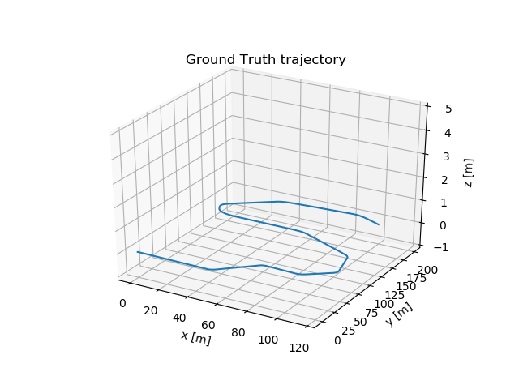
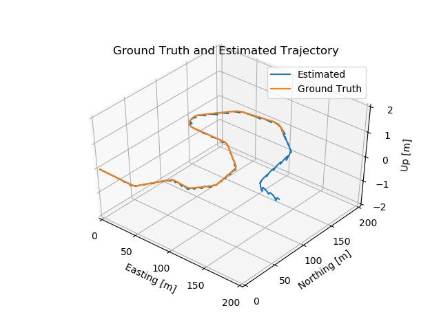
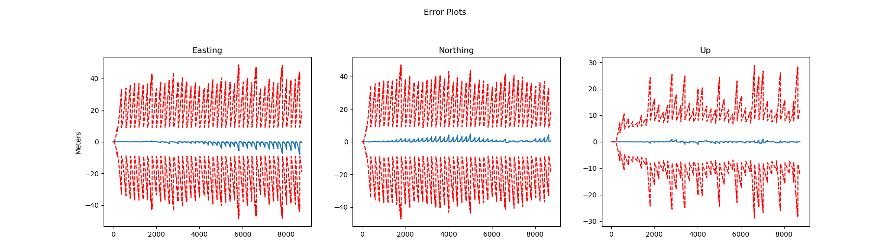
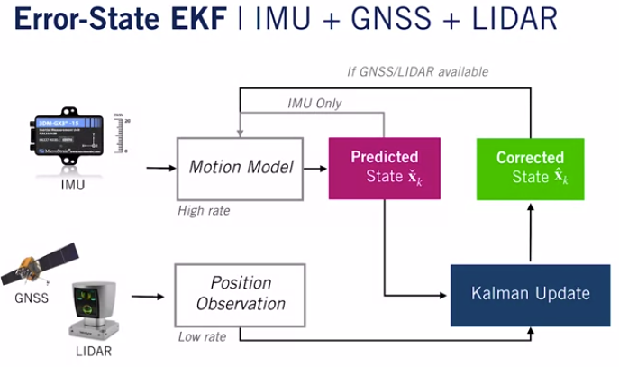
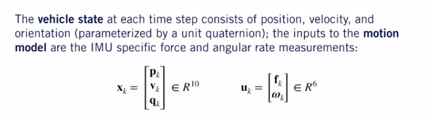
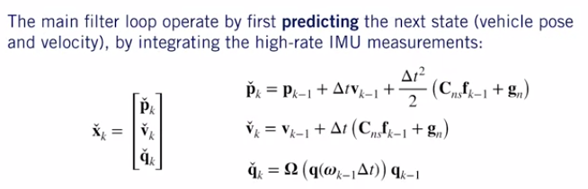
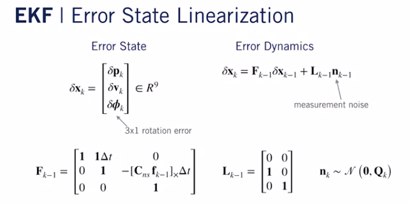
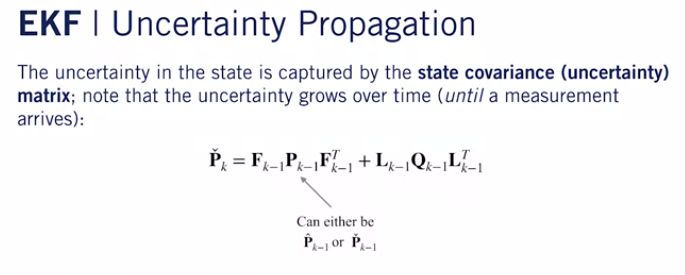
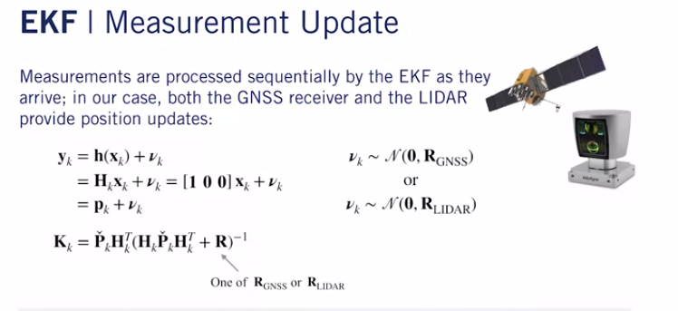
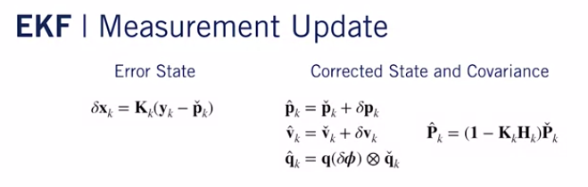

# State-Estimation-and-Localization

Error State Extended Kalman filter is implemented in this project for the SelfDrivingCars Course provided in Coursera by University of Toronto.

The Results are plotted here :

 

Error tolerance : x, y, z

The coding is found in the es_ekf.py file.

The concepts used are provided below(Materials were in the course provided by University of Toronto)

1) INITIALIZATION

The state and the input model were initialized in the following format

2) PREDICTION STEP

3) ERROR STATE INITIALIZATION

4) UNCERTAINITY PROPAGATION

5) MEASUREMENT UPDATE

